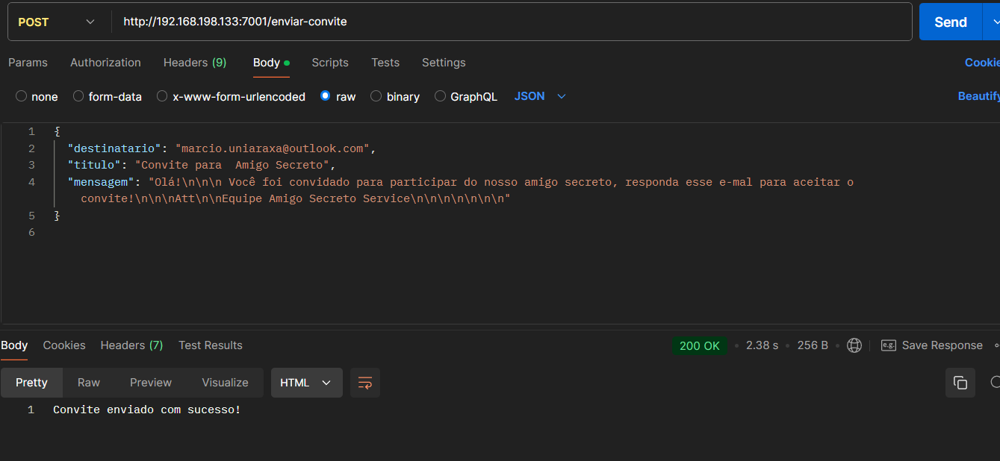
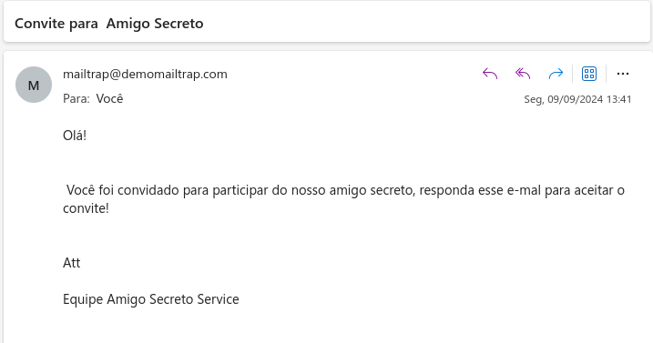

## Desafio-DPSIII_UNIARAXA
Desafio fina da disciplina DPSIII - Módulo IX - Curso Análise e Desenvolvimento de Sistemas

Para realizar os testes na API de convite utilizei o Mailtrap, pela facilidade de cadastro e configuração. Basta acessar https://mailtrap.io/ , realizar o cadastro e gerar a chave da API.

 **OBS.: Na versão FREE só é possível enviar e-mail do domínio deles, para o seu e-mail cadastrado!

 ### Envio via Postman

 

 ### E-mail recebido

 

 *** Para rodar o projeto será necessário incluir um arquivo .env com as variáveis MAIL_USER E MAIL_PASS ***